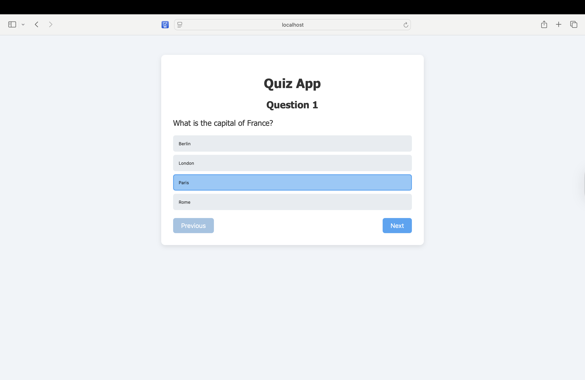
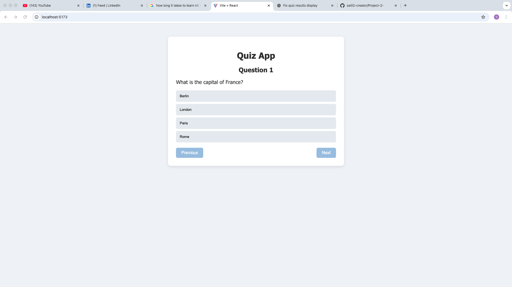
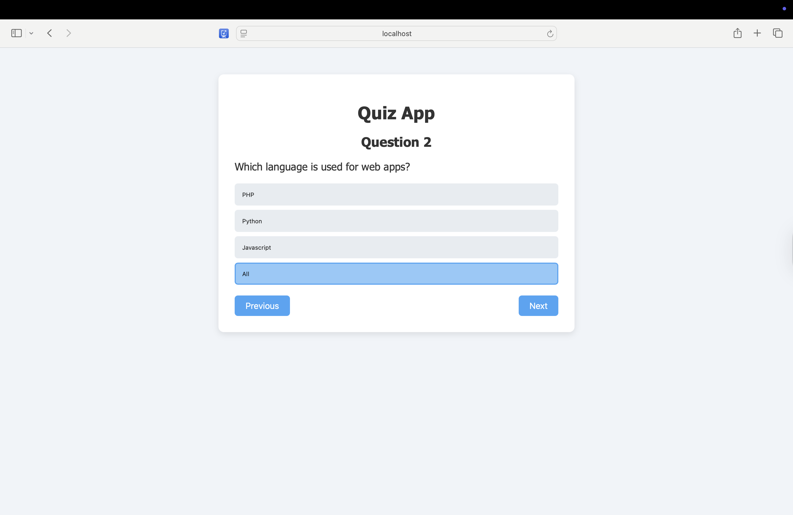
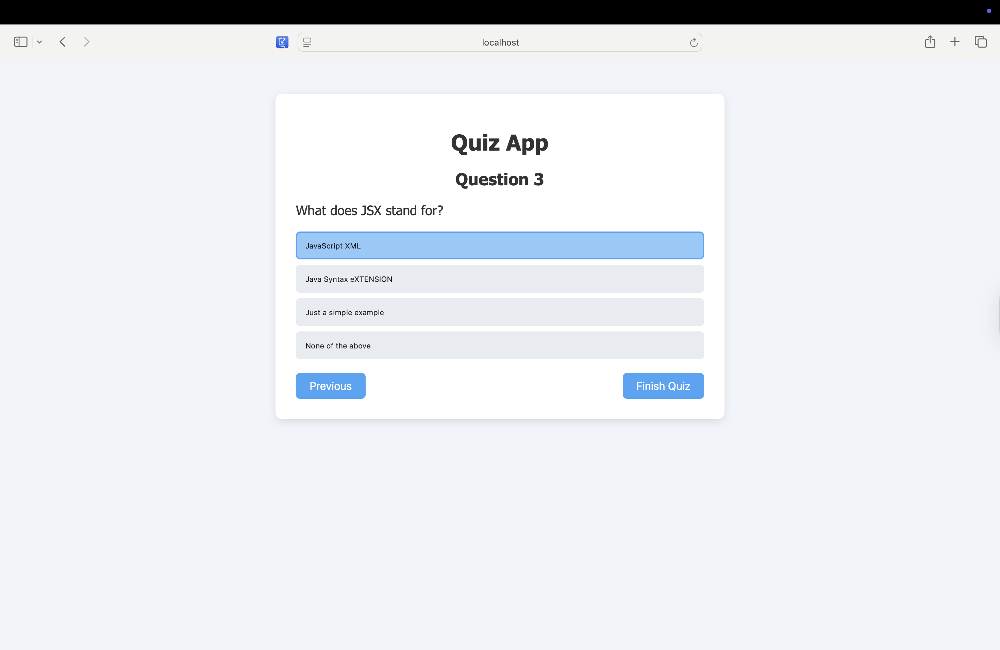
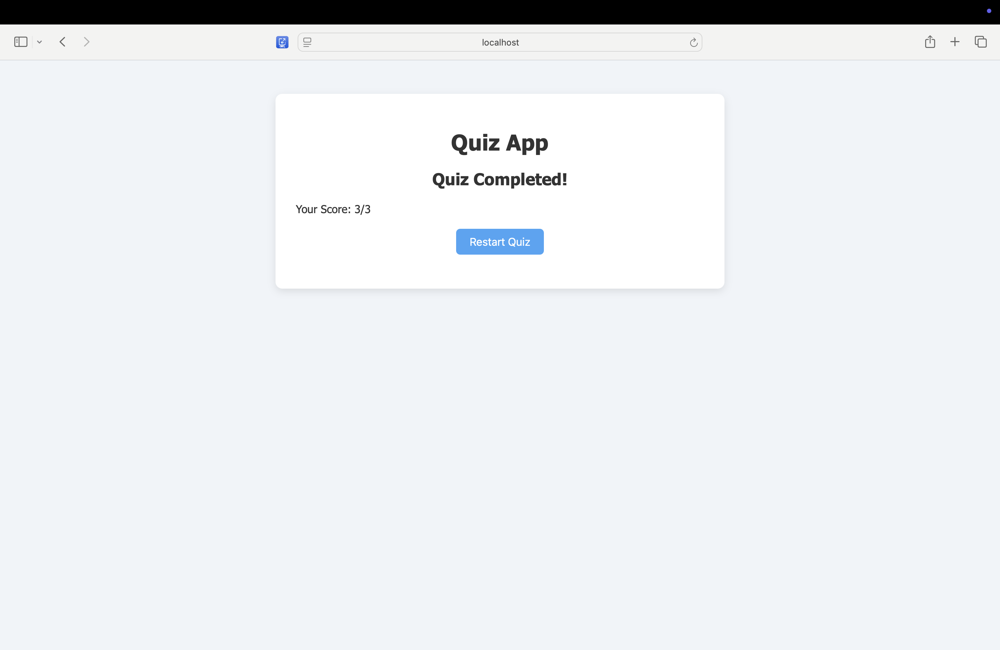

# React Quiz App

A simple interactive quiz application built with React.  
Users can answer multiple-choice questions, navigate between them, and view their score at the end.

## Features

- Multiple-choice questions with four options each
- Navigation between previous and next questions
- "Finish Quiz" button to submit and view results
- Score calculation based on correct answers
- Restart quiz option

## Technologies Used

- React (Functional Components + Hooks)
- JavaScript (ES6+)
- CSS (for styling)

# Usage 

- Start the quiz by answering the first question.

-  Click Next to move to the next question.

-  You can go back to previous questions using Previous.

- On the last question, click Finish Quiz to see your score.

-  Use Restart Quiz to try again.

 ## 📸 Testing

These are few screenshots how the quiz works

- The website was tested on safari browser

## 🌐 Live Demo

